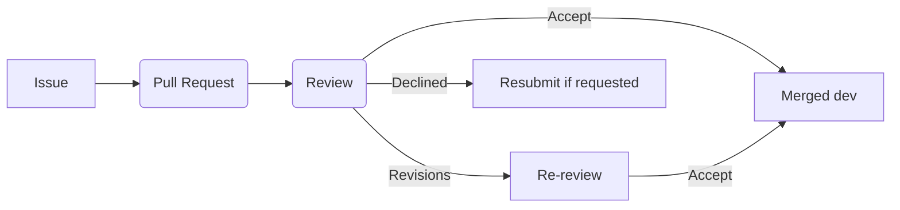

# Contribution guidelines

At STAPLE, we want your contributions to be successful. In this document we will help you get started, understand what kind of contributions you can make without talking to us, and what contributions you should (probably) talk to us about first.

## Getting started

If you want to get started contributing to STAPLE, we recommend you set up your development environment using the [README](https://github.com/STAPLE-verse/STAPLE/blob/dev/README.md).

Anyone can open a pull request to STAPLE, which will automatically run certain checks. This means you can focus more time on contributing and less time on testing. We may ask you to make some changes during the review process, to ensure everything fits nicely. But rest assured, we share the burden with you, and you are not on your own!

Before you get started please make sure to read through our [code of conduct](add link). Then, a good place to start would be looking at the issues at https://github.com/STAPLE-verse/STAPLE/issues. Issues that are tagged as _good-first-issue_ are ready to be worked on. If noone else is working on that issue you can claim it by leaving a comment on the issue. If you have any questions feel free to ask in the issue by leaving a comment and someone from the team will help you out. We are happy that you spend your time making STAPLE better!

If you would like to contribute to STAPLE long-term you can join our community on [Slack](https://join.slack.com/t/staple-talk/shared_invite/zt-2u8yd4n7n-0ehpV2UmA0ORUvM_qQcDcA).

## Contributions we welcome anytime

In general, contributions we welcome are small unknown issues (see the list below) or known issues listed in our repository.

We always welcome certain contributions:

- Documenting issues with STAPLE (maybe link to the issues guide?)
- Fixing typos or grammatical errors
- Adding unit tests to components, mutations, queries, or hooks
- Improving type casting to be more robust
- Improving error messages and safeguards
- Standardized styling
- Translations of text and documentation

## Contributions to discuss

In general, we discourage adding large unknown contributions without talking to us.

If your contribution falls outside those we welcome anytime, please get in touch with us first. We do this to ensure you do not waste your time. For example, if you are looking to make a substantial contribution to STAPLE, please open an issue first so we can discuss your approach. We want your effort to be successful, and getting feedback early helps ensure your contribution is aligned with the project.

What we actively discourage is adding features and opening up pull requests for them without talking to us first. You do this at your own risk, and with no guarantee that your contribution gets included.

## How to make a pull request

Use the five minute rule:

- If the task takes less than five minutes to fix, then you can fix the issue and create a pull request.
- If the task will take more than five minutes, please open an issue first describing the proposed fixes for community discussion.

Once you are ready to submit your code, please use the appropriate pull request template.

Please note that STAPLE is a small team, and pull requests will be responded to as quickly as possible. Depending on the time of year, it may take a few weeks. Feel free to check in if we have not responded within that time frame.

All pull requests should be sent to the `dev` branch for initial review. We will respond with comments and/or requests for updates. After approval, we will test the update on our [development website](https://test.staple.science). Once we verify that the update is integrated appropriated within STAPLE, we will pull the changes in the `main` branch to put on the [production website](https://app.staple.science/).

Here is the current workflow for pull requests:

